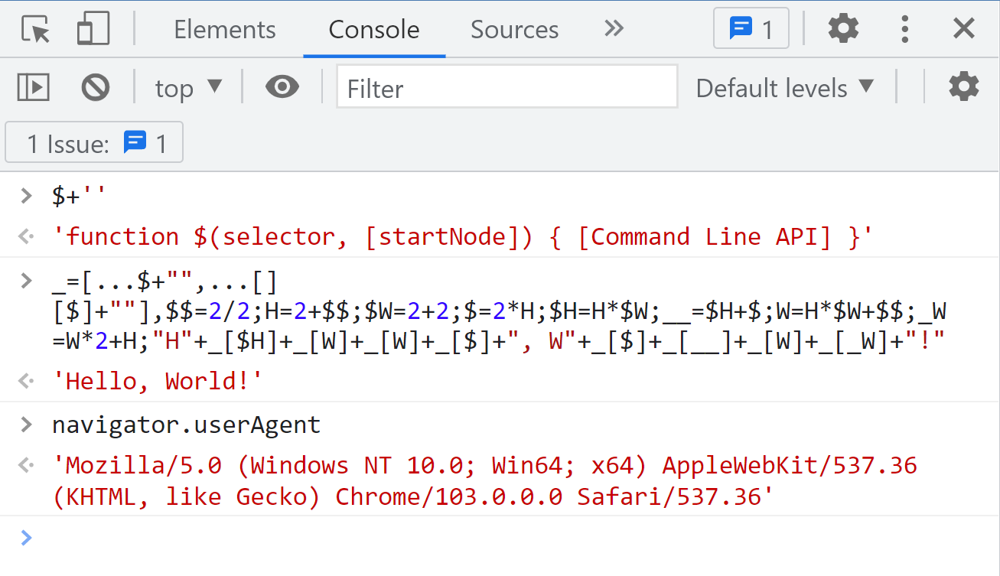

# Explain

## Used characters

-   `H`
-   `W`
-   `2`

## Execute environment

Chrome devtools (this solution rely on the Chrome Devtools. It cannot run as a normal JavaScript file.)

## Screenshot



## Uncompressed version

```js
// Note: $ + '' equals to "'function $(selector, [startNode]) { [Command Line API] }'" in Chrome Devtools.
_ = [...($ + ''), ...([][$] + '')]
$1 = 2 / 2
$3 = 2 + $1
$4 = 2 + 2
$6 = 2 * $3
$12 = $3 * $4
$18 = $12 + $6
$13 = $3 * $4 + $1
$29 = $13 * 2 + $3

'H' + _[$12] + _[$13] + _[$13] + _[$6] + ', W' + _[$6] + _[$18] + _[$13] + _[$29] + '!'
```
